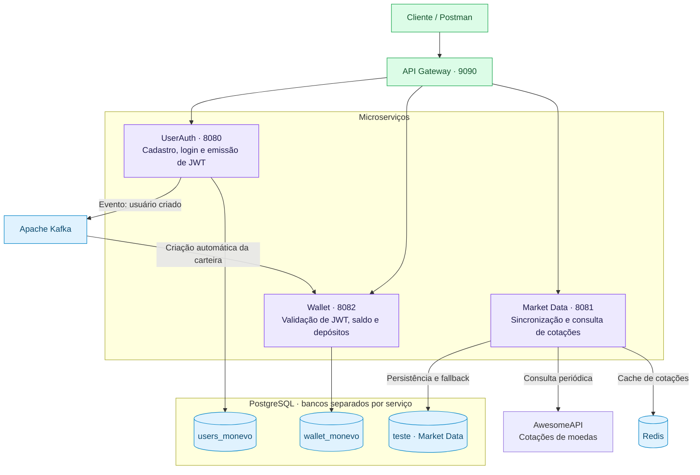

# Monevo

**Carteira digital em BRL e consulta de cotações com Java e Spring Boot.**

O Monevo é um projeto de backend que reúne autenticação, carteira digital e cotações de moedas em uma arquitetura de microserviços. Pelo API Gateway, o usuário pode criar uma conta, fazer login, consultar seu saldo, realizar depósitos simulados e acompanhar cotações obtidas de uma API externa.

A criação da carteira acontece de forma assíncrona via Kafka. As operações da carteira são protegidas por JWT, e as cotações são consultadas no Redis, com fallback para PostgreSQL. A próxima etapa é implementar a compra e venda simulada de moedas usando o saldo em BRL.

## Funcionalidades

- **Cadastro e login:** autenticação com emissão de token JWT.
- **Criação automática de carteira:** o UserAuth publica um evento no Kafka e a Wallet cria a carteira com saldo inicial zero.
- **Consulta de saldo:** identificação do usuário pelo JWT, sem enviar o ID na requisição.
- **Depósitos simulados em BRL:** validação do valor, atualização do saldo e registro do depósito em uma transação.
- **Consulta de cotações:** dólar americano, dólar canadense, euro, libra, Bitcoin e Ethereum, cotados em BRL.
- **Atualização periódica:** consulta à API externa a cada 60 segundos, com armazenamento no PostgreSQL e cache no Redis.
- **Fallback de consulta:** quando a cotação não está disponível no cache, o Market Data busca o último registro no banco.
- **Entrada unificada:** endpoints acessíveis pelo API Gateway e ambiente local executado com Docker Compose.

## Arquitetura



O gateway encaminha as requisições para o serviço responsável. O UserAuth emite o JWT, e a Wallet valida o token e usa a claim `userId` para localizar a carteira do usuário. A consulta de cotações é pública.

Cada serviço possui seu próprio banco dentro da instância PostgreSQL usada no ambiente local. O Kafka conecta o cadastro à criação da carteira; o Market Data mantém o acesso à API externa, ao cache e ao banco dentro do próprio serviço.

## Tecnologias

| Área | Tecnologias |
|---|---|
| Backend | Java 21, Spring Boot, Spring Web |
| Gateway | Spring Cloud Gateway Server Web MVC |
| Segurança | Spring Security, JWT, OAuth2 Resource Server na Wallet |
| Persistência | Spring Data JPA, Hibernate, PostgreSQL |
| Mensageria e cache | Apache Kafka, Redis |
| Execução local | Maven, Docker, Docker Compose |

## Endpoints

Base URL pelo gateway: `http://localhost:9090`.

| Método | Endpoint | Descrição | JWT |
|---|---|---|---|
| `POST` | `/monevo/auth/register` | Criar uma conta | Não |
| `POST` | `/monevo/auth/login` | Fazer login e obter o token | Não |
| `GET` | `/monevo/wallet/balance` | Consultar o saldo da própria carteira | Sim |
| `POST` | `/monevo/wallet/deposits` | Depositar saldo na própria carteira | Sim |
| `GET` | `/consulta-cotacao/{coin}` | Consultar uma cotação em BRL | Não |

Nas rotas protegidas, envie `Authorization: Bearer <token>`. Para consultar o dólar americano, por exemplo, use `/consulta-cotacao/USD-BRL`.

### Exemplo de depósito

```http
POST /monevo/wallet/deposits
Authorization: Bearer <token>
Content-Type: application/json
```

```json
{
  "amount": 100.00
}
```

O depósito é uma operação de simulação: adiciona saldo virtual à carteira. O usuário é identificado pelo token, e o corpo da requisição contém apenas o valor.

## Executar localmente

Pré-requisito: Docker com Docker Compose.

1. Crie um arquivo `.env` na raiz do projeto com uma chave JWT de pelo menos 32 bytes. O Compose repassa a mesma chave ao UserAuth e à Wallet.

   ```dotenv
   JWT_KEY=substitua_por_uma_chave_aleatoria_com_pelo_menos_32_bytes
   ```

2. Na raiz do projeto, execute:

   ```bash
   docker compose up -d --build
   ```

3. Aguarde a inicialização dos serviços e teste os endpoints pelo gateway.

Fluxo de teste: **cadastro → login → consulta de saldo → depósito → nova consulta de saldo → consulta de cotação**. A carteira pode levar alguns instantes para aparecer após o cadastro, pois sua criação depende do consumo do evento no Kafka.

> O ambiente atual usa `ddl-auto: create-drop` no UserAuth e na Wallet. As tabelas podem ser recriadas nas inicializações; os dados desses serviços devem ser tratados como temporários durante os testes.

## Próximos passos

- **Trading:** compra e venda simulada de moedas, usando cotações do Market Data e saldo da Wallet.
- **Posições e histórico:** controle da quantidade de moedas adquiridas, custo médio e registro das operações no Trading.
- **Resultados:** cálculo de lucro e prejuízo das vendas e visualização em dashboards do Grafana.

## Objetivo do projeto

O Monevo é um projeto de estudo e portfólio voltado ao desenvolvimento backend. O fluxo implementado exercita comunicação entre microserviços, processamento assíncrono, autenticação com JWT, transações de banco de dados e cache com fallback, aplicado a uma simulação financeira.
