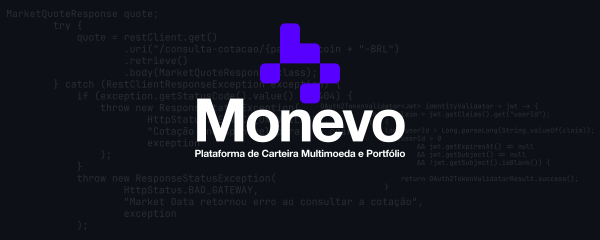
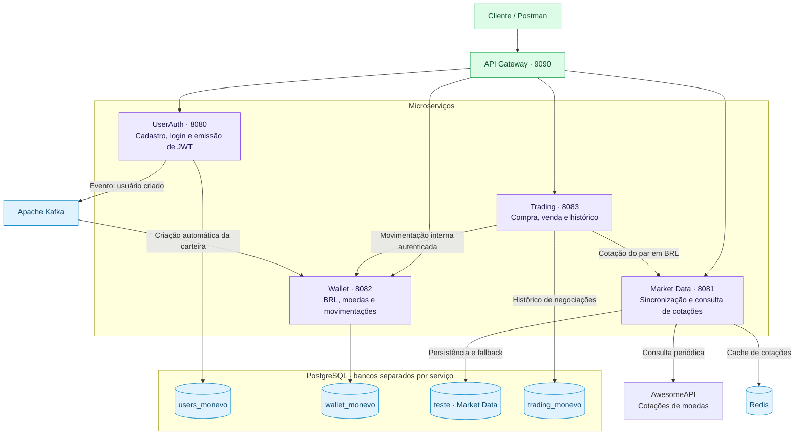

<picture>
  <source media="(prefers-color-scheme: dark)" srcset="./monevo_dark.svg">
  <source media="(prefers-color-scheme: light)" srcset="./monevo_white.svg">
  
</picture>

# Monevo

**Carteira digital e negociação simulada de moedas com Java e Spring Boot.**

O Monevo é um projeto de backend para simular a compra e venda de moedas usando saldo em reais e cotações obtidas de uma API externa. Pelo API Gateway, o usuário cria uma conta, faz login, deposita saldo virtual em BRL, negocia moedas e acompanha sua carteira e seu histórico de operações.

A arquitetura reúne UserAuth, Wallet, Market Data e Trading. A carteira é criada de forma assíncrona via Kafka, as operações do usuário são protegidas por JWT e o Market Data consulta cotações no Redis, com fallback para PostgreSQL. O Trading calcula o valor da negociação e solicita à Wallet a movimentação dos saldos.

## Funcionalidades

- **Cadastro e login:** autenticação com emissão de token JWT.
- **Criação automática de carteira:** o UserAuth publica um evento no Kafka e a Wallet cria a carteira com saldo inicial zero.
- **Consulta de saldo:** identificação do usuário pelo JWT, sem enviar o ID na requisição.
- **Depósitos simulados em BRL:** validação do valor, atualização do saldo e registro do depósito em uma transação.
- **Carteira com múltiplas moedas:** consulta do saldo em BRL e das quantidades de moedas adquiridas.
- **Compra e venda simuladas:** o usuário informa moeda e quantidade; o Trading obtém o preço e calcula o total em BRL com `BigDecimal`.
- **Movimentação transacional:** a Wallet verifica a disponibilidade e altera o saldo em BRL e a quantidade da moeda na mesma transação, com bloqueio da carteira durante a operação.
- **Histórico de negociações:** registro de quantidade, preço utilizado, total, data e status, com consulta paginada por usuário.
- **Consulta de cotações:** dólar americano, dólar canadense, euro, libra, Bitcoin e Ethereum, cotados em BRL.
- **Atualização periódica:** consulta à API externa a cada 60 segundos, com armazenamento no PostgreSQL e cache no Redis.
- **Fallback de consulta:** quando a cotação não está disponível no cache, o Market Data busca o último registro no banco.
- **Entrada unificada:** endpoints acessíveis pelo API Gateway e ambiente local executado com Docker Compose.

## Arquitetura



O gateway encaminha as requisições para o serviço responsável. O UserAuth emite o JWT; Wallet e Trading validam o token e usam a claim `userId` para identificar o usuário. A consulta de cotações é pública.

Cada serviço possui seu próprio banco dentro da instância PostgreSQL usada no ambiente local. O Kafka conecta o cadastro à criação da carteira. O Trading acessa Market Data e Wallet por HTTP na rede interna; não consulta diretamente os bancos ou o Redis desses serviços.

A rota interna da Wallet usa HTTP Basic com uma credencial do Trading e não é publicada no gateway. Os depósitos adicionam somente BRL; as quantidades das demais moedas são alteradas por compras e vendas.

### Fluxo de uma negociação

1. O usuário envia seu JWT, a moeda e a quantidade pelo gateway.
2. O Trading solicita a cotação ao Market Data, que consulta Redis ou faz fallback para o banco.
3. O Trading valida o preço e a idade da coleta, calcula o total e registra a operação como `PENDING`.
4. A Wallet verifica o saldo disponível e executa os dois movimentos na mesma transação: BRL e quantidade da moeda.
5. Após a confirmação, o Trading registra `COMPLETED`. Recusas explícitas ficam como `FAILED`; falhas de comunicação sem confirmação ficam como `UNKNOWN`.

Na compra, o Trading utiliza `ask`; na venda, `bid`. O total em BRL é arredondado para centavos: para cima na compra e para baixo na venda. A idade máxima aceita da coleta é de cinco minutos. `coinConsultation` representa o horário da coleta pela aplicação, não o horário original da negociação no fornecedor.

Exemplo ilustrativo, sem taxas: comprar **2 USD** a **R$ 6,50** por unidade desconta **R$ 13,00** e adiciona **2 USD** à carteira. O preço e o total são calculados no backend.

## Tecnologias

| Área | Tecnologias |
|---|---|
| Backend e integração | Java 21, Spring Boot, Spring Web, RestClient |
| Gateway | Spring Cloud Gateway Server Web MVC |
| Segurança | Spring Security, JWT, OAuth2 Resource Server na Wallet e no Trading, HTTP Basic na rota interna da Wallet |
| Persistência | Spring Data JPA, Hibernate, PostgreSQL |
| Mensageria e cache | Apache Kafka, Redis |
| Execução local | Maven, Docker, Docker Compose |

## Endpoints

Base URL pelo gateway: `http://localhost:9090`.

| Método | Endpoint | Descrição | JWT |
|---|---|---|---|
| `POST` | `/monevo/auth/register` | Criar uma conta | Não |
| `POST` | `/monevo/auth/login` | Fazer login e obter o token | Não |
| `GET` | `/monevo/wallet/balance` | Consultar o saldo da própria carteira | Sim |
| `POST` | `/monevo/wallet/deposits` | Depositar saldo na própria carteira | Sim |
| `GET` | `/monevo/wallet/portfolio` | Consultar BRL e quantidades de moedas | Sim |
| `GET` | `/consulta-cotacao/{coin}` | Consultar uma cotação em BRL | Não |
| `POST` | `/monevo/trading/buy` | Comprar uma quantidade de moeda | Sim |
| `POST` | `/monevo/trading/sell` | Vender uma quantidade de moeda | Sim |
| `GET` | `/monevo/trading/history?page=0&size=20` | Consultar o próprio histórico | Sim |
| `GET` | `/monevo/trading/{tradeId}` | Consultar uma negociação da própria conta | Sim |

Nas rotas protegidas, envie `Authorization: Bearer <token>`. Para consultar o dólar americano, por exemplo, use `/consulta-cotacao/USD-BRL`.

### Exemplo de depósito

```http
POST /monevo/wallet/deposits
Authorization: Bearer <token>
Content-Type: application/json
```

```json
{
  "amount": 100.00
}
```

O depósito é uma operação de simulação: adiciona saldo virtual à carteira. O usuário é identificado pelo token, e o corpo da requisição contém apenas o valor.

### Exemplo de compra

```http
POST /monevo/trading/buy
Authorization: Bearer <token>
Content-Type: application/json
```

```json
{
  "coin": "USD",
  "quantity": 2
}
```

Para vender, use o mesmo formato de corpo em `/monevo/trading/sell`. Os códigos aceitos são `USD`, `CAD`, `EUR`, `GBP`, `BTC` e `ETH`. A operação depende de saldo suficiente em BRL na compra ou de quantidade suficiente da moeda na venda.

## Executar localmente

Pré-requisito: Docker com Docker Compose.

1. Crie um arquivo `.env` na raiz do projeto com uma chave JWT de pelo menos 32 bytes e uma senha para a integração interna. O Compose repassa a chave aos serviços que emitem ou validam JWT, e a senha à Wallet e ao Trading.

   ```dotenv
   JWT_KEY=substitua_por_uma_chave_aleatoria_com_pelo_menos_32_bytes
   TRADING_SERVICE_PASSWORD=substitua_por_uma_senha_para_integracao
   ```

2. Inicie o PostgreSQL e confira os bancos disponíveis:

   ```bash
   docker compose --env-file .env up -d db
   docker exec monevo_db psql -U niches -d postgres -c "\l"
   ```

   O Compose cria `users_monevo` na primeira inicialização do volume. Se os demais bancos ainda não existirem, execute os comandos correspondentes abaixo. Eles são necessários somente para os bancos ausentes:

   ```bash
   docker exec monevo_db createdb -U niches wallet_monevo
   docker exec monevo_db createdb -U niches teste
   docker exec monevo_db createdb -U niches trading_monevo
   ```

3. Na raiz do projeto, construa e inicie o ambiente:

   ```bash
   docker compose --env-file .env up -d --build
   ```

4. Aguarde a inicialização dos serviços e a primeira sincronização das cotações. Confira o estado com `docker compose ps -a` e teste os endpoints pelo gateway.

Fluxo de teste: **cadastro → login → depósito → consulta da carteira → consulta de cotação → compra → consulta da carteira → venda → consulta da carteira → histórico**. A carteira pode levar alguns instantes para aparecer após o cadastro, pois sua criação depende do consumo do evento no Kafka.

> Os arquivos atuais usam `ddl-auto: create-drop` no UserAuth, Wallet, Market Data e Trading. As tabelas podem ser recriadas nas inicializações; os dados devem ser tratados como temporários durante os testes.

## Limites da implementação atual

- As negociações movimentam saldo virtual, sem execução de ordens em uma corretora ou transferência de dinheiro real.
- A transação da Wallet garante a atualização conjunta de seus saldos. O registro no Trading usa outro banco e não participa dessa mesma transação.
- Operações `UNKNOWN`, ou `PENDING` deixadas após uma interrupção, exigem conferência manual. Não há reconciliação automática nem proteção contra execução repetida da mesma solicitação.
- O histórico registra os preços e valores negociados; custo médio e lucro/prejuízo ainda não são calculados.

## Próximos passos

- **Resultados:** cálculo de custo médio e lucro/prejuízo das vendas.
- **Analytics:** visualização do histórico e dos resultados em dashboards do Grafana.
- **Recuperação de operações:** reconciliação de negociações cujo resultado ficou sem confirmação.

## Objetivo do projeto

O Monevo é um projeto de estudo e portfólio voltado ao desenvolvimento backend. O fluxo implementado exercita comunicação entre microserviços, processamento assíncrono, autenticação com JWT, transações de banco de dados e cache com fallback, aplicado a uma simulação financeira.
